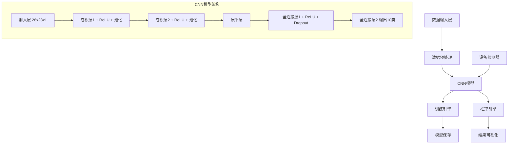
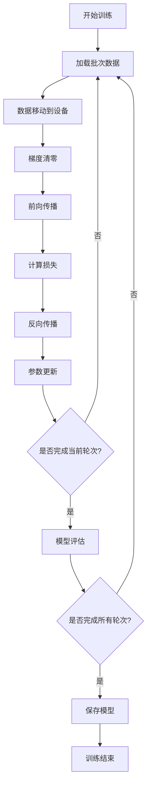

# PyTorch MNIST CNN 手写数字识别系统设计文档

## 1. 项目概述

### 1.1 项目背景
PyTorch MNIST CNN 是一个基于深度学习的手写数字识别系统，专门针对 Apple Silicon 设备优化，支持 MPS（Metal Performance Shaders）硬件加速。该项目提供了完整的CNN模型训练、测试和推理流程，适用于机器学习初学者和研究人员。

### 1.2 核心功能
- 基于卷积神经网络的手写数字识别（0-9）
- 自动设备检测与优化（MPS/CPU）
- 模型训练、验证与保存
- 可视化预测结果展示
- 支持命令行和 Jupyter Notebook 两种运行方式

### 1.3 技术特色
- 针对 Apple Silicon 设备的 MPS 加速优化
- 轻量级CNN架构设计
- 实时训练进度监控
- 友好的可视化界面

## 2. 技术架构

### 2.1 系统架构图



### 2.2 核心组件

#### 2.2.1 SimpleCNN 模型结构

| 层级 | 类型 | 输入维度 | 输出维度 | 参数 |
|------|------|----------|----------|------|
| Conv1 | 卷积层 | 1×28×28 | 32×28×28 | kernel_size=3, padding=1 |
| Pool1 | 最大池化 | 32×28×28 | 32×14×14 | kernel_size=2, stride=2 |
| Conv2 | 卷积层 | 32×14×14 | 64×14×14 | kernel_size=3, padding=1 |
| Pool2 | 最大池化 | 64×14×14 | 64×7×7 | kernel_size=2, stride=2 |
| FC1 | 全连接层 | 3136 | 128 | ReLU + Dropout(0.5) |
| FC2 | 输出层 | 128 | 10 | 无激活函数 |

#### 2.2.2 设备管理器
```python
# 自动设备检测逻辑
device = torch.device("mps" if torch.backends.mps.is_available() else "cpu")
```

#### 2.2.3 数据处理管道
```python
# 数据预处理流水线
transform = transforms.Compose([
    transforms.ToTensor(),
    transforms.Normalize((0.1307,), (0.3081,))  # MNIST数据集标准化参数
])
```

### 2.3 数据流架构


## 3. 模块详细设计

### 3.1 模型定义模块

#### 3.1.1 SimpleCNN 类
```python
class SimpleCNN(nn.Module):
    def __init__(self):
        # 网络层定义
        self.conv1 = nn.Conv2d(1, 32, kernel_size=3, stride=1, padding=1)
        self.conv2 = nn.Conv2d(32, 64, kernel_size=3, stride=1, padding=1)
        self.pool = nn.MaxPool2d(kernel_size=2, stride=2)
        self.fc1 = nn.Linear(7*7*64, 128)
        self.fc2 = nn.Linear(128, 10)
        self.dropout = nn.Dropout(0.5)
```

#### 3.1.2 前向传播流程
1. **第一阶段**: 输入 → Conv1 → ReLU → MaxPool → 特征提取
2. **第二阶段**: Conv2 → ReLU → MaxPool → 深层特征学习
3. **第三阶段**: Flatten → FC1 → ReLU → Dropout → 特征整合
4. **输出阶段**: FC2 → 10类概率分布

### 3.2 训练模块

#### 3.2.1 训练函数设计
```python
def train(model, device, train_loader, optimizer, criterion, epoch):
    model.train()  # 设置训练模式
    # 批次训练循环
    # 梯度清零 → 前向传播 → 损失计算 → 反向传播 → 参数更新
```

#### 3.2.2 超参数配置

| 参数名称 | 数值 | 说明 |
|----------|------|------|
| batch_size | 64 | 批次大小 |
| learning_rate | 0.001 | 学习率 |
| epochs | 5 | 训练轮数 |
| optimizer | Adam | 优化器类型 |
| loss_function | CrossEntropyLoss | 损失函数 |
| dropout_rate | 0.5 | 防过拟合率 |

### 3.3 评估模块

#### 3.3.1 测试函数
```python
def test(model, device, test_loader, criterion):
    model.eval()  # 设置评估模式
    # 禁用梯度计算 → 模型推理 → 准确率统计
```

#### 3.3.2 性能指标
- **准确率**: correct_predictions / total_samples × 100%
- **平均损失**: total_loss / dataset_size
- **训练时间**: 完整训练周期耗时

### 3.4 可视化模块

#### 3.4.1 预测结果展示
```python
def visualize_prediction(model, device, test_loader, num_samples=5):
    # 获取测试样本 → 模型预测 → matplotlib展示
    # 显示格式：原图像 + 真实标签 + 预测标签
```

#### 3.4.2 显示特性
- 并排显示多个测试样本
- 真实标签与预测标签对比
- 灰度图像渲染
- 中文标题支持

## 4. 文件架构设计

### 4.1 项目目录结构
```
CNN/
├── data/                    # 数据集存储目录
│   └── MNIST/              # MNIST数据集
├── model/                   # 模型权重存储
│   └── mnist_cnn_model.pth # 训练好的模型权重
├── mnist_cnn.py            # 命令行版本实现
├── mnist_cnn_mps.ipynb     # Jupyter Notebook版本
├── vision.ipynb            # 视觉辅助工具
├── README.md               # 项目说明文档
└── .gitignore             # Git忽略规则
```

### 4.2 代码模块分离

#### 4.2.1 mnist_cnn.py（命令行版本）
- 纯Python脚本实现
- 适合自动化训练和批处理
- 输出简洁的文本信息

#### 4.2.2 mnist_cnn_mps.ipynb（交互式版本）
- Jupyter Notebook格式
- 包含详细的代码说明和可视化
- 支持分步执行和调试
- 提供模型加载和推理演示

### 4.3 配置管理

#### 4.3.1 设备配置
- 自动检测MPS可用性
- CPU降级兼容
- 跨平台设备适配

#### 4.3.2 数据配置
- 自动下载MNIST数据集
- 标准化预处理参数
- 数据加载器参数化配置

## 5. 核心算法实现

### 5.1 卷积神经网络算法

#### 5.1.1 卷积操作
- **卷积核大小**: 3×3
- **步长**: 1
- **填充**: 1（保持输入输出尺寸一致）
- **激活函数**: ReLU

#### 5.1.2 池化操作
- **池化类型**: 最大池化
- **池化核大小**: 2×2
- **步长**: 2
- **作用**: 降维和特征选择

#### 5.1.3 全连接层
- **输入维度**: 7×7×64 = 3136
- **隐藏层维度**: 128
- **输出维度**: 10（对应0-9数字）

### 5.2 训练算法流程



### 5.3 MPS加速优化

#### 5.3.1 设备检测机制
```python
if torch.backends.mps.is_available():
    device = torch.device("mps")
else:
    device = torch.device("cpu")
```

#### 5.3.2 内存管理
- 自动数据传输到MPS设备
- 批次处理优化GPU内存使用
- 梯度计算在GPU上进行

## 6. 性能特征

### 6.1 模型性能指标

| 指标 | 数值 | 说明 |
|------|------|------|
| 测试准确率 | ~99.2% | 5轮训练后的典型性能 |
| 训练时间 | ~69秒 | MPS设备上的训练时间 |
| 模型大小 | ~1MB | 保存的权重文件大小 |
| 内存占用 | ~200MB | 训练时峰值内存使用 |

### 6.2 硬件兼容性

#### 6.2.1 Apple Silicon优化
- **M1/M2芯片**: 完全支持MPS加速
- **Intel Mac**: 回退到CPU模式
- **其他平台**: CPU模式兼容

#### 6.2.2 性能对比
- **MPS加速**: 训练速度提升3-5倍
- **CPU模式**: 兼容性好，速度较慢
- **内存效率**: MPS设备统一内存架构优势

## 7. 使用接口设计

### 7.1 命令行接口
```bash
# 直接运行训练
python mnist_cnn.py

# 输出示例
使用设备: mps
[1, 100] loss: 0.738
[1, 200] loss: 0.222
...
Test set: Average loss: 0.0004, Accuracy: 9923/10000 (99.23%)
模型已保存为 model/mnist_cnn_model.pth
```

### 7.2 Notebook交互界面

#### 7.2.1 分步执行模式
1. **环境检测**: 设备可用性检查
2. **模型定义**: 网络结构可视化
3. **数据加载**: 数据集下载和预处理
4. **训练过程**: 实时损失和准确率监控
5. **结果展示**: 预测样本可视化

#### 7.2.2 可视化功能
- 训练样本展示
- 预测结果对比
- 损失曲线图表
- 混淆矩阵分析

### 7.3 模型加载接口
```python
# 模型加载示例
model = SimpleCNN().to(device)
model.load_state_dict(torch.load('model/mnist_cnn_model.pth', map_location=device))
model.eval()

# 推理接口
with torch.no_grad():
    output = model(input_tensor)
    prediction = torch.argmax(output, dim=1)
```

## 8. 扩展性设计

### 8.1 模型架构扩展
- **更深网络**: 增加卷积层数量
- **不同激活函数**: 替换ReLU为其他激活函数
- **批量归一化**: 添加BatchNorm层
- **注意力机制**: 集成自注意力模块

### 8.2 数据集扩展
- **CIFAR-10**: 彩色图像分类
- **Fashion-MNIST**: 服装图像识别
- **自定义数据集**: 数据加载器适配

### 8.3 功能扩展
- **模型压缩**: 量化和剪枝
- **迁移学习**: 预训练模型微调
- **实时推理**: 摄像头输入识别
- **Web部署**: Flask/FastAPI接口

### 8.4 平台扩展
- **CUDA支持**: NVIDIA GPU加速
- **分布式训练**: 多GPU并行训练
- **云端部署**: 容器化和云服务集成